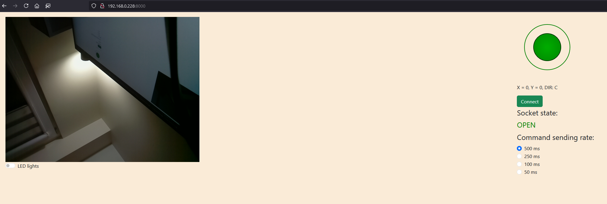

# Raspberry Pi controlled vehicle

## Features
- Open source
- 3D printed construction
- 4 geared DC motors
- TPU printed one-part "tracks" 
- powered by 6V sealed acid battery
- [ORP](https://openroboticplatform.com/) compatible mounting points (easy to expand)
- Raspberry Pi Zero W
- custom robot controller HAT
- camera
- LED lights
- web interface

## Future plans
- power management (battery voltage monitoring, automatic shutdown, current draw monitoring)
- rotable camera mount
- LIDAR [D200 WaveShare](https://www.waveshare.com/wiki/D200_LiDAR_Kit)
- advanced indoor positioning system

## Software installation

1. Use Raspberry Pi Imager to install Raspberry Pi OS Lite Legacy (**Bullseye**, it won't work on Bookworm and later!) on microSD card. Pre-configure it for headless operation (WiFi credentials, username, password, enable SSH).
2. Plug in microSD card into Raspberry Pi, wait for it to boot.
3. Find an IP address of your RPi and connect to it via SSH.
4. Update system:

    ```
    sudo apt-get update && sudo apt-get upgrade -y
    ```

5. Enable legacy camera stack

    ```
    sudo raspi-config
    ```

    select `Interface options -> Legacy camera support` and enable it
    go back to main menu, finish and reboot

6. Download and run installation script:

    ⚠️ it may take long time to complete, so be patient

    ```
    wget https://raw.githubusercontent.com/Poly-Mentor/RPi0-vehicle/main/install.sh && chmod +x install.sh && bash install.sh
    ```

7. (optional) Save compiled binary

    If you want to avoid long re-building raspivid_mjpeg_server after OS reinstallation, you can zip it:

    ```
    zip -r ~/raspivid_mjpeg_server_bin.zip ~/raspivid_mjpeg_server/raspivid_mjpeg_server-master/target/release/raspivid_mjpeg_server 
    ```
    then copy it to your PC or pendrive.
    
    After system reinstallation, just copy it to your home directory. `install.sh` script will recognize it, unzip, and install this version without downloading Rust and compiling.

8. Modify hardcoded IP addresses

    This is temporary shortcut i took. I'll eliminate that in the future, but for now you need to replace IPs in two files:

    `www/index.html`
    ```html
        <body style="background-color:antiquewhite ">
            <div class="container-fluid">
                <div class="row p-3">
                    <div class="col-md-8" id="cameraImage">
                        <!-- *****replace with your IP, keep the port unchanged****** -->
                        
                        <div class="form-check form-switch">
                            <input class="form-check-input" type="checkbox" role="switch" id="LEDswitch">
                            <label class="form-check-label" for="LEDswitch">LED lights</label>
                        </div>
                    </div>
    ```
    and
    `www/script.js`
    ```javascript
    function initSocket(){
        // replace with your IP, keep the port unchanged
        mySocket = new WebSocket("ws://192.168.0.228:13254", "joystick_protocol");
    ```
## Running

execute starting script

```
. ~/RPi0-vehicle/RPi0-vehicle-main/start.sh
```

open `http://<your-RPi-IP-address>:8000` in your browser on any device in home network, you should see the control panel:


To stop the servers just kill launched jobs:

```
(venv) fs@RPiZero:~/RPi0-vehicle/RPi0-vehicle-main $ jobs
[1]   Running                 raspivid -ISO 0 -t 0 -n -o - -w 640 -h 480 -fps 10 -b 25000000 -cd MJPEG | raspivid_mjpeg_server &
[2]-  Running                 python vehicle_ws_server.py &
[3]+  Running                 python -m http.server --directory ./www &

(venv) fs@RPiZero:~/RPi0-vehicle/RPi0-vehicle-main $ kill %1 %2 %3

(venv) fs@RPiZero:~/RPi0-vehicle/RPi0-vehicle-main $ jobs
[1]   Terminated              raspivid -ISO 0 -t 0 -n -o - -w 640 -h 480 -fps 10 -b 25000000 -cd MJPEG | raspivid_mjpeg_server
[2]-  Terminated              python vehicle_ws_server.py
[3]+  Terminated              python -m http.server --directory ./www
```

## Credits
Thanks for developers sharing their code which has been used there:
- [Pithikos](https://github.com/Pithikos) for [Python Websocket Server](https://github.com/Pithikos/python-websocket-server)
- [kig](https://github.com/kig) for [Raspivid MJPEG Server](https://github.com/kig/raspivid_mjpeg_server)
- [bobboteck](https://github.com/bobboteck) for [JoyStick](https://github.com/bobboteck/JoyStick)